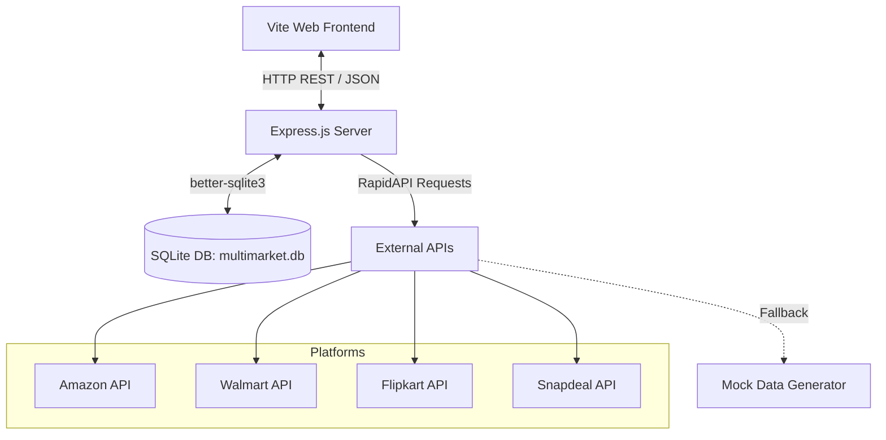

# 🏷️ Multimarket - Smart E-Commerce Price Aggregator & Tracking Hub

A premium, modern e-commerce search aggregator, price comparison engine, and price-tracking application. **Multimarket** crawls and retrieves real-time pricing data across major shopping platforms (Amazon, Walmart, Flipkart, and Snapdeal) using RapidAPIs, featuring an intelligent Better-SQLite3 local caching layer, automated mock fallbacks, and a highly interactive, animated 3D frontend.

---

## ✨ Features

- **🔍 Multi-Platform Aggregated Search**: Query Amazon, Walmart, Flipkart, and Snapdeal simultaneously.
- **⚡ Smart Database Caching**: SQLite-powered caching layer in WAL (Write-Ahead Logging) mode, keeping API responses stored locally for 24 hours to ensure blazing-fast loads and avoid rate limits.
- **📈 Price Tracking & History**: Automatically tracks price points over time to help users identify the best deals.
- **🤖 Robust Fallback Architecture**: Seamlessly falls back to rich, procedurally generated mock data if API limits are reached or API keys are not supplied.
- **🛠️ Rich Product Specifications**: Automatically parses queries (e.g., watches, phones, audio gear, laptops) and synthesizes comprehensive technical specifications, user reviews, and star ratings.
- **💖 Favorites & Watchlist**: Save items to a personalized, SQL-persisted favorites list.
- **✨ Immersive 3D Visual Experience**: A stunning modern frontend leveraging **Vite**, **Three.js** (WebGL 3D graphics), **GSAP** (Smooth micro-animations), and modern styling.

---

## 🏛️ System Architecture & Data Schema

The project is structured as a full-stack JavaScript application, with an Express.js API backend and a Vite-powered single-page application.



### 🗄️ Relational Database Schema
The SQLite database (`multimarket.db`) enforces referential integrity (`foreign_keys = ON`) and runs in WAL mode for optimal concurrent performance. It consists of the following key tables:

1. **`users`**: Manages registered user accounts (supports standard and admin roles). Seeded by default with `admin@multimarket.com` and `user@multimarket.com`.
2. **`products`**: Stores details of scraped products (name, brand, category, synthesized rich specification metadata, price, ratings, and image links).
3. **`platforms`**: Contains target comparison platforms (Amazon, Walmart, Flipkart, Snapdeal) and their associated metadata (logo URLs, homepages).
4. **`comparisons`**: A relational mapping table that logs individual price listings, tracking which products are available on which platforms, their current price, and link.
5. **`search_cache`**: A caching lookup index mapping query terms to JSON results with a 24-hour expiration threshold.
6. **`favorites`**: Stores user-bookmarked items.
7. **`price_history`**: Tracks all historic price entries for individual products to display trends.

---

## 🚀 Getting Started

### 📋 Prerequisites
- **Node.js** (v18 or higher recommended)
- **npm** (v9 or higher)

### 📥 Installation & Setup

1. **Clone the repository** (or navigate to the project directory):
   ```bash
   cd Multimarket
   ```

2. **Install root & backend dependencies**:
   ```bash
   npm install
   ```

3. **Install frontend dependencies**:
   ```bash
   npm install --prefix frontend
   ```

4. **Environment Setup**:
   Create a `.env` file in the root directory:
   ```env
   PORT=3000
   RAPIDAPI_KEY=your_rapidapi_key_goes_here
   ```
   *Note: If no RapidAPI key is provided, the server will log a warning and fallback gracefully to procedurally generated mock data so you can test all features immediately!*

---

## 🏃 Run the Application

Start both the backend server and the Vite development server concurrently with a single command:

```bash
npm run dev
```

- **Backend Server**: Runs on [http://localhost:3000](http://localhost:3000)
- **Frontend Dev Server**: Runs on [http://localhost:5173](http://localhost:5173) (automatically proxies or redirects traffic)

---

## 🔌 API Endpoints

### 🔐 Authentication
* **`POST /api/login`**
  * Authenticate user credentials.
  * *Request Body:* `{ "email": "user@multimarket.com", "password": "user123" }`

### 🔍 Search & Data
* **`GET /api/search?q=<query>`**
  * Queries all platforms simultaneously, saves result to SQL cache, and logs price trends.
* **`GET /api/products/:id`**
  * Fetches the item details, synthesized rich specs (screen size, CPU, etc.), reviews, and compares it against other platforms.

### 💖 Favorites List
* **`GET /api/favorites`** - Fetch all user bookmarked items.
* **`POST /api/favorites`** - Add a product to favorites.
* **`DELETE /api/favorites/:id`** - Remove a product from favorites.

---

## 🛠️ Stack & Technologies

* **Backend**: Node.js, Express.js, `better-sqlite3` (WAL mode, foreign key constraints, parameterized queries)
* **Frontend**: HTML5, Vanilla JavaScript, CSS variables (Tailwind CSS custom config)
* **Graphics & Animation**: Three.js, GSAP, Postprocessing, Lucide Icons, Framer Motion
* **Utilities**: Concurrently, dotenv, CORS, Class Variance Authority
